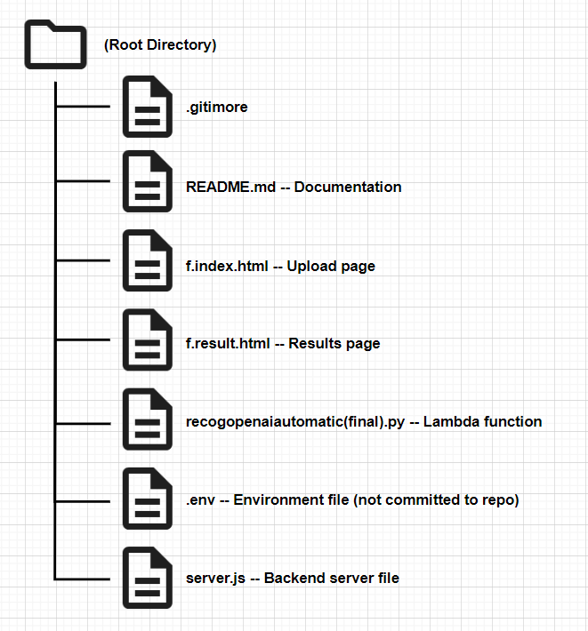

# Web app for making news article (fictional) from photos.

### Overview
This web application was created for the **IS215 course** to turn photos into image labels, and then to  fictional news articles. AWS Rekognition was used for analyzing uploaded images to identify labels such as objects, scenes, and actions. These identified labels then are sent to GPT-3.5-turbo, which generates news article. The uploaded image and the article are displayed on results page.

### Features
Images in JPG or PNG format can be uploaded by users. Each image is stored securely in an S3 bucket.  A Lambda function is triggered once the image is stored and the the image is processed using Rekognition. This function generates labels from the image and submitted them as input to GPT-3.5-turbo to generate articles.

### Repository Structure
 

### Environment
A `.env` file is used to store API keys and sensitive data. The setup is configured so that the S3 bucket triggers the Lambda function, deploying the function using the `rekogopenaiautomatic_v2.py` script. The function sends the detected labels to GPT-3.5-turbo, which returns a fictional news article based on the labels.

### Deployment
The application runs on an EC2 instance. Once the instance is started, the application can be launched. Users access the upload page (`index.html`) to submit images. The resulting article and image can be viewed on the results page (`result.html`).

### Guidelines
To meet repository guidelines, API keys and sensitive data are excluded from version control. Best practices for handling AWS and OpenAI credentials were observed. The repository has been made public. Group member contributions were made via forks and pull requests, with documentation supplied for each change.

### License
This project was designed for the IS215 course and is not intended for commercial use.
